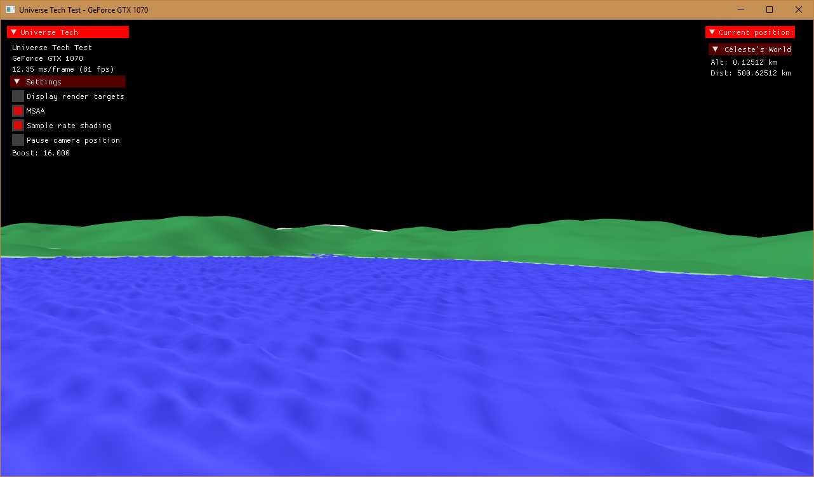

# UniverseTech
A Vulkan-API engine for testing procedural content generation tools.

Dependencies are in ./external, tracked as git submodules. 
 - If you're using an GUI git client this will likely handle submodules for you. 
 - For Git CLI users, ```git submodule update --init --recursive```

Currently built as a Visual Studio 2017 Win 10 x64 project, with AVX and multithreading support. You will need a graphics card with Vulkan support in the drivers.




Base engine capabilities in current version:

- Arbitrary model loading with texture and normal maps. (Uses ASSIMP importer.)
- Image importer to create textures.
- Scene graph handling loaded models.
- JSON file format for level data.
- Continuous level of detail procedural planet generator.
- Entity Component System architecture for data-driven behaviour models.
- Forward shading model with ray-marching / sphere-tracing support for SDF.
- Physically-based rendering pipeline based on Pixar / UE4 BDRF renderers.
- GUI overlay with input handling.
- Multithreading.
- Input management.
- Windows, Mac, Linux, iOS and Android support in-engine (but project needs work to compile targets).