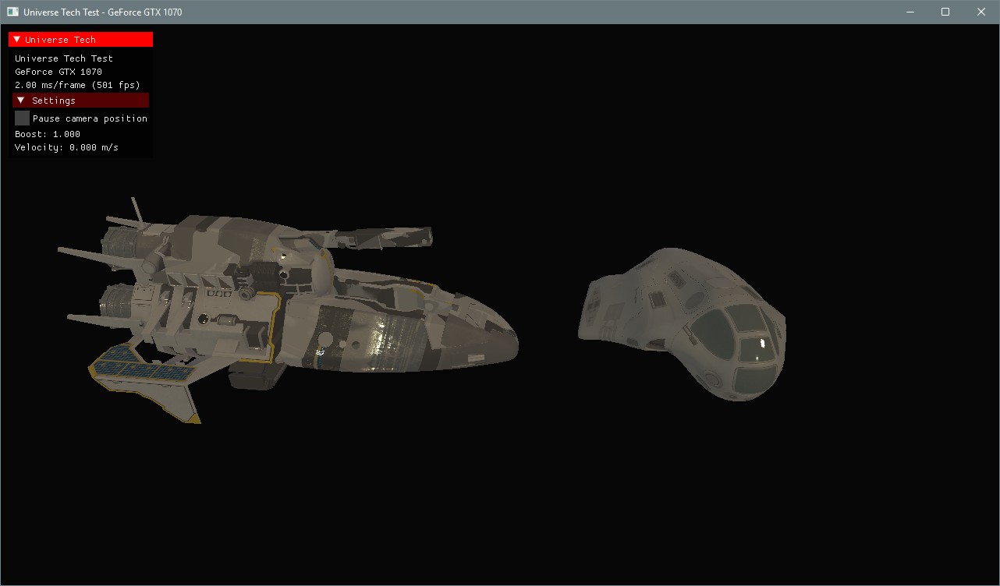

# UniverseTech
A Vulkan-API engine for testing procedural content generation tools.

Dependencies are in ./external, tracked as git submodules. 
 - If you're using an GUI git client this will likely handle submodules for you. 
 - For Git CLI users, ```git submodule update --init --recursive```

Currently built as a Visual Studio 2017 Win 10 x64 project, with AVX and multithreading support. You will need a graphics card with Vulkan support in the drivers.




Base engine capabilities in current version:

- Physically-based rendering pipeline based on Pixar / UE4 BDRF renderers.
- Forward shading model with ray-marching / sphere-tracing support for SDF.
- Entity Component System architecture for data-driven behaviour models.
- Scene graph with object hierarchy, full object lifecycle.
- Event-driven model to allow loosely-couple object behaviours.
- FMOD audio engine supporting positional and stereo audio emitters.
- GUI overlay with input handling.
- Multithreading.
- Input management.
- Arbitrary model loading with texture and normal maps. (Uses ASSIMP importer.)
- Image importer to create textures from any image file format.
- Plugin-based asset management supporting asynchronous loading of asset data.
- Continuous level of detail procedural planet generator. (WIP)
- Windows, Mac, Linux, iOS and Android support in-engine (but project needs work to compile targets).
